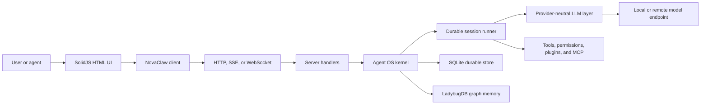
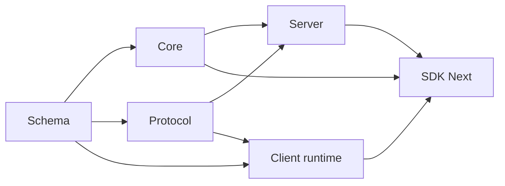

# NovaClaw Maintainer and Agent Technical Guide

Inspection baseline: 2026-07-28.

## 1. Purpose

This guide explains the NovaClaw product, architecture, and technology stack.

This guide has three audiences:

- NovaClaw maintainers
- Coding agents
- Technical reviewers.

Read this guide before you change an unfamiliar subsystem.

Read the nearest `AGENTS.md` file before you change files in its scope.

Treat the source code as the authority when this guide and the code disagree.

Update this guide when an architecture boundary or supported technology changes.

## 2. Language policy

This guide applies the rules and the intention of ASD-STE100 Issue 9.

ASD-STE100 is a controlled language for clear and unambiguous technical text.

This guide uses technical nouns when the software domain requires them.

This guide defines a technical noun before its first detailed use.

Procedures use short instructions in the imperative form.

Each procedural sentence contains one instruction.

Descriptive sentences use the active voice when the agent is known.

Each descriptive sentence has one main topic.

Lists divide complex information into small units.

This guide does not claim certified ASD-STE100 conformance.

No approved checker completed a full dictionary audit of this guide.

Official references:

- [ASD-STE100 Issue 9](https://www.asd-ste100.org/assets/files/ASD-STE100_ISSUE9.pdf)
- [ASD-STE100 FAQ](https://www.asd-ste100.org/STE_faq.html).

### 2.1 Technical terms

**Local-first** means that the product stores data and runs primary services on the user computer.

An **agent** is software that uses a model, instructions, and tools to complete a task.

A **model endpoint** is a local or remote service that supplies model inference.

The **kernel** is the set of services that controls sessions, tools, permissions, and durable data.

**Headless** means that a program runs without a graphical user interface.

A **sidecar** is a separate local process that supplies services to the desktop application.

A **Location** identifies one canonical workspace directory and its optional workspace identity.

**V1** identifies the current live product path.

**V2** identifies the modular architecture under active development.

A **Software Development Kit (SDK)** is a public library for NovaClaw integrations.

A **Promise client** is a generated client that returns JavaScript Promise values.

An **Application Programming Interface (API)** is a public software interaction contract.

**Server-Sent Events (SSE)** is a one-way event stream from an HTTP server.

A **WebSocket** is a two-way connection between a client and a server.

The **Model Context Protocol (MCP)** connects a model host to external tools and context.

**WebAssembly (WASM)** is a portable binary instruction format.

An **Atom Shell Archive (ASAR)** is an Electron application archive.

**Bubblewrap** is a Linux program that creates an isolated process environment.

A **Linux namespace** isolates one process view from the host system.

A **pseudoterminal (PTY)** connects an interactive shell process to a user interface.

## 3. Product definition

NovaClaw is a local-first operating system for AI agents.

An **agent session** is a durable process that runs an agent against a model.

An agent session has a model, instructions, tools, permissions, context, and durable history.

A parent session can start a child session.

A child session inherits applicable configuration from its parent.

A parent session can wait for a child result.

NovaClaw shows sessions as processes in an HTML user interface.

NovaClaw does not have an interactive terminal user interface.

The command-line interface supplies server, one-shot run, browser launch, and maintenance commands.

The server supplies an HTTP health endpoint.

NovaClaw uses local models as its primary model devices.

NovaClaw also accepts optional remote model endpoints.

NovaClaw does not require a paid model API.

NovaClaw does not send telemetry or user content by default.

The kernel has these primary responsibilities:

- Session admission, execution, interruption, and exit
- Durable session and event storage
- Model-independent LLM requests and streams
- Tool registration and execution
- Permission control
- Location-scoped service composition
- Plugin and MCP extension boundaries
- Application registry services.

The product has these primary user-interface responsibilities:

- Session control
- Process inspection
- Model and provider settings
- Tool permission prompts
- Files, notes, search, and application launch
- Desktop and browser delivery.

Editor services, code indexers, and language servers are not kernel services.

Agents can install these services when a task requires them.

Third-party developers can also supply these services as applications or plugins.

## 4. Runtime modes

| Mode       | User interface         | Main runtime            | Server position          | Primary entry                    |
| ---------- | ---------------------- | ----------------------- | ------------------------ | -------------------------------- |
| Desktop    | Electron HTML renderer | Electron and Node.js    | Local sidecar            | `packages/desktop`               |
| Web        | Browser HTML renderer  | Browser                 | Separate NovaClaw server | `packages/app`                   |
| Headless   | None                   | Bun                     | Same process             | `packages/novaclaw/src/index.ts` |
| Standalone | Browser HTML renderer  | Compiled Bun executable | Same process             | Built `novaclaw` binary          |
| Embedded   | Host application       | Effect runtime          | In-process router        | `packages/sdk-next`              |

The desktop renderer and web application use the same SolidJS application tree.

The desktop main process starts the Node.js sidecar.

The standalone executable embeds the built web interface.

The embedded host opens no network listener.

## 5. System architecture



The current repository contains a live V1 path and a modular V2 path.

`packages/novaclaw` contains the live command-line and server product path.

The V2 path separates semantic values, domain behavior, transport contracts, and handlers.

Use the V2 package boundary for new V2 work.

Do not move a V1 feature into V2 without an explicit migration plan.

### 5.1 V2 dependency direction



Keep `packages/schema` free of host services.

Keep `packages/protocol` free of databases and runtime implementations.

Keep Client runtime code free of Core and Server dependencies.

Use Server to adapt Protocol contracts to Core services.

Use SDK Next to compose Client, Core, and Server in one process.

## 6. Package ownership

| Package                          | Owner responsibility                          | Forbidden responsibility      |
| -------------------------------- | --------------------------------------------- | ----------------------------- |
| `packages/schema`                | Shared semantic values and runtime schemas    | Host services and databases   |
| `packages/llm`                   | Provider-neutral LLM model and wire adapters  | Session orchestration         |
| `packages/core`                  | Kernel, sessions, tools, storage, permissions | Public HTTP placement         |
| `packages/protocol`              | HTTP groups, middleware placement, schemas    | Handler implementations       |
| `packages/server`                | Handlers and server assembly                  | Client generation policy      |
| `packages/client`                | Generated Promise and Effect clients          | Hand-edited generated source  |
| `packages/sdk-next`              | Scoped in-process host                        | Alternative domain behavior   |
| `packages/novaclaw`              | Live CLI, server, V1 path, product assembly   | Interactive terminal UI       |
| `packages/plugin`                | Public plugin API                             | Private kernel implementation |
| `packages/app`                   | Shared SolidJS application                    | Electron native access        |
| `packages/desktop`               | Electron integration and packages             | Kernel business rules         |
| `packages/ui`                    | Shared controls, themes, icons, and styles    | Session execution             |
| `packages/session-ui`            | Session message presentation                  | Session persistence           |
| `packages/effect-drizzle-sqlite` | Generic Effect and Drizzle adapter            | NovaClaw domain tables        |
| `packages/effect-sqlite-node`    | Node.js SQLite Effect client                  | NovaClaw domain behavior      |
| `packages/http-recorder`         | Deterministic HTTP and WebSocket cassettes    | Provider semantics            |
| `packages/httpapi-codegen`       | Client generation from Effect HttpApi         | Product endpoint selection    |
| `packages/script`                | Shared build and release helpers              | Product runtime behavior      |

## 7. Core execution model

### 7.1 Session durability

NovaClaw admits a prompt before it starts model execution.

Prompt admission creates one durable input record.

The execution wake is advisory.

The serialized runner promotes admitted input at a safe provider-turn boundary.

A provider turn contains one explicit `llm.stream(request)` call.

The runner reloads projected history before durable continuation.

The process-global coordinator joins duplicate work for one session.

The coordinator permits different sessions to run at the same time.

### 7.2 Service scopes

A **global service** belongs to one NovaClaw process.

A Location identifies one canonical workspace directory and its optional workspace identity.

A **Location service** belongs to one canonical workspace location.

Session execution coordination is global.

Session runners, tools, permissions, and file systems are Location-scoped.

Use a canonical Location reference.

An incorrect Location shape can create a duplicate service graph.

### 7.3 Context

**System Context** is the structured instruction set for a model.

**Session History** is the selected chronological conversation.

A **Context Source** supplies one typed System Context value.

A **Context Epoch** keeps one stable provider-cache baseline.

The runner admits context changes at safe provider-turn boundaries.

Do not use the term “system prompt” for the complete V2 context model.

### 7.4 Events and terminal streams

Durable session events use Server-Sent Events (SSE).

Instance-wide live events also use SSE.

The two event streams have different replay rules.

PTY terminal data uses a WebSocket connection.

A PTY is a pseudoterminal.

The PTY connection uses a short-lived connection ticket.

## 8. Technology index

| Technology                     |                Version | Primary role                                            |
| ------------------------------ | ---------------------: | ------------------------------------------------------- |
| TypeScript workspace catalog   |                  5.8.2 | Main implementation language                            |
| TypeScript desktop declaration |                 ~5.6.2 | Desktop package declaration                             |
| Bun                            |                 1.3.14 | Package, script, test, server, and executable toolchain |
| Node.js                        |                    24+ | Electron and sidecar runtime                            |
| Effect                         |          4.0.0-beta.83 | Services, errors, scopes, streams, and schemas          |
| SolidJS                        |                 1.9.10 | Shared HTML user interface                              |
| Tailwind CSS                   |                 4.1.11 | Utility CSS compilation                                 |
| Kobalte                        |                0.13.11 | Accessible SolidJS controls                             |
| TanStack Solid Query           |                 5.91.4 | Server-derived UI data                                  |
| Marked                         |                 17.0.1 | Markdown parsing                                        |
| Shiki                          |                  4.2.0 | Source-code highlighting                                |
| DOMPurify                      |                  3.3.1 | Rendered HTML sanitization                              |
| Electron                       |                 42.3.3 | Desktop shell                                           |
| Vite                           |                  7.1.4 | Web and renderer build                                  |
| electron-vite                  |                    5.x | Electron build coordination                             |
| Bubblewrap                     | Host package, unpinned | Linux Agent Jail                                        |
| Ghostty Web                    |   Git commit `513463a` | Browser terminal renderer                               |
| `@lydell/node-pty`             |          1.2.0-beta.12 | Node.js PTY adapter                                     |
| `bun-pty`                      |                  0.4.8 | Bun PTY adapter                                         |
| Parcel Watcher                 |                  2.5.1 | Native filesystem event source                          |
| SQLite                         |       Runtime built-in | Durable relational storage                              |
| Drizzle ORM                    |             1.0.0-rc.2 | Typed SQLite access and schema definitions              |
| LadybugDB WASM                 |                 0.18.2 | Local graph memory                                      |
| Effect HttpApi                 |            Effect beta | V2 HTTP contracts and handlers                          |
| Hono                           |                 4.10.7 | Catalog entry with no first-party source import         |
| MCP SDK                        |                 1.29.0 | External tool and context integration                   |
| MTcute                         |                 0.31.0 | Telegram user-account transport                         |
| Baileys                        |             7.0.0-rc13 | WhatsApp linked-device transport                        |
| OpenAPI and local codegen      |     Repository package | Contract publication and client generation              |
| Turborepo                      |                 2.8.13 | Workspace task coordination                             |
| Playwright                     |                 1.59.1 | Browser end-to-end tests                                |
| electron-builder               |                26.15.2 | Desktop packages                                        |
| electron-updater               |                  6.8.9 | Desktop update checks and installation                  |
| Oxlint                         |                 1.60.0 | Static lint checks                                      |
| Prettier                       |                  3.6.2 | Source formatting                                       |

## 9. Technology details

Each technology section uses the same structure.

The structure gives the purpose, ownership, rules, checks, and risks.

### 9.1 TypeScript

#### Purpose

TypeScript is the primary implementation language.

TSX is TypeScript syntax that contains user-interface markup.

TypeScript defines contracts for sessions, events, tools, providers, protocols, and clients.

TypeScript types do not validate data during execution.

Use Effect Schema for external or persisted data.

#### Ownership

The root `tsconfig.json` extends the Bun TypeScript configuration.

Most packages use strict package-specific configurations.

SolidJS packages use bundler resolution and the SolidJS JSX source.

The plugin package uses NodeNext module resolution.

Most package type checks use the native-preview `tsgo` tool.

#### Rules

Use type inference when the result is clear.

Add explicit types at public boundaries.

Use `unknown` for untrusted input.

Do not use `any` in new code.

Do not rename imports.

Do not use star imports.

Use the package type-check script.

Do not edit generated TypeScript clients.

#### Key files

- `tsconfig.json`
- `packages/*/tsconfig.json`
- `packages/client/src/generated`
- `packages/client/src/generated-effect`
- `packages/httpapi-codegen`.

#### Checks

```sh
bun turbo typecheck
```

Run a focused package check from that package directory.

```sh
bun typecheck
```

Run the lint check from the repository root.

```sh
bun run lint
```

#### Risks

The repository uses more than one module-resolution mode.

The repository also contains more than one TypeScript compiler declaration.

A valid import in one package can fail in another package.

A type assertion can hide invalid runtime data.

### 9.2 Bun

#### Purpose

Bun supplies the package manager, script runner, test runner, bundler, and server runtime.

The standalone executable contains a Bun runtime.

The Electron application does not use Bun as its application runtime.

#### Ownership

The root `package.json` pins Bun `1.3.14`.

The root workspace catalog controls shared dependency versions.

`bun.lock` records the dependency resolution.

`bunfig.toml` controls installation and test behavior.

`packages/novaclaw/script/build.ts` creates standalone executables.

`packages/novaclaw/script/build-node.ts` creates the Node.js sidecar.

#### Rules

Use Bun for dependency changes.

Keep `bun.lock` with each dependency change.

Do not run package tests from the repository root.

Keep `--conditions=browser` on the source CLI command.

Do not enable code splitting for the standalone executable.

Do not add a `bun:` import to the Node.js sidecar.

#### Checks

Check the installed version.

```sh
bun --version
```

Install the locked dependencies.

```sh
bun install --frozen-lockfile
```

Run the supported test coordinator.

```sh
bun run test
```

Build and smoke-test the local standalone executable.

```sh
bun run --cwd packages/novaclaw build --single --skip-install
```

#### Risks

Cross-platform builds can download Bun target files.

The Bun runtime and `@types/bun` versions can differ.

An indirect dependency loader can hide a dependency from the executable compiler.

### 9.3 Effect

#### Purpose

Effect supplies typed services, failures, scopes, streams, concurrency, logging, and schemas.

A **Layer** is a construction plan for services.

A **Scope** controls the lifetime of a resource.

A **Fiber** is a lightweight Effect task.

#### Ownership

`packages/core` owns the service graph and domain services.

`packages/protocol` owns Effect HttpApi contracts.

`packages/server` binds contracts to Core services.

`packages/sdk-next` composes an in-process scoped host.

The repository pins matching Effect `4.0.0-beta.83` packages.

#### Rules

Bind a service to a named variable before you call its methods.

Do not nest service acquisition inside another Effect call.

Use `Effect.acquireRelease` for acquired resources.

Use `Effect.scoped` when the program owns scoped resources.

Use typed failures for expected errors.

Use defects only for impossible or fatal states.

Keep synchronous parsing synchronous.

Do not build an independent service graph inside a handler.

#### Key files

- `packages/core/src/effect/layer-node.ts`
- `packages/core/src/effect/app-node.ts`
- `packages/core/src/effect/runtime.ts`
- `packages/core/src/location-services.ts`
- `packages/server/src/routes.ts`
- `packages/sdk-next/src/novaclaw.ts`.

#### Checks

Run the type check in each changed Effect package.

```sh
bun typecheck
```

Run tests from each changed package directory.

```sh
bun test
```

#### Risks

Effect 4 is a beta dependency.

NovaClaw uses unstable Effect HTTP and SQL modules.

The repository contains a patch for Effect.

A duplicated Layer can start a second database, watcher, gateway, or worker.

### 9.4 SolidJS

#### Purpose

SolidJS supplies the shared HTML user interface.

The browser application and Electron renderer use the same application tree.

The Electron main and preload processes stay outside SolidJS.

#### Ownership

`packages/app` owns the shared application and route tree.

`packages/ui` owns shared controls, themes, icons, and styles.

`packages/session-ui` owns session message presentation.

`packages/desktop/src/renderer` supplies the Electron platform adapter.

#### Rules

Use `useSessionView(sessionID)` for per-session view state.

Do not assemble a per-session persistence key.

Let the URL mount each session view.

Do not mount a session view from a tab, launcher, or home list.

Use `requestAnimationFrame()` only for paint-related work.

Run required focus and state operations synchronously.

Do not write an object through a getter-backed store key.

Use `queryClient.setQueryData()` for query-backed data.

Keep a readiness promise for warm and cold persisted stores.

#### Key files

- `packages/app/src/app.tsx`
- `packages/app/src/context/server-sdk.tsx`
- `packages/app/src/context/server-sync.tsx`
- `packages/app/src/pages/session/use-session-view.ts`
- `packages/app/src/utils/persist.ts`
- `packages/desktop/src/renderer/index.tsx`.

#### Checks

```sh
cd packages/app
bun typecheck
bun run test:unit
bun run test:browser
bun run build
```

Run end-to-end tests after a route or session-view change.

```sh
bun run test:e2e
```

#### Risks

An incorrect context can show stale session data.

A second session mounter can cause delayed focus changes.

A missing cleanup can retain an SSE listener, timer, or reactive owner.

A direct Node.js import can break the browser renderer.

### 9.5 Electron

#### Purpose

Electron supplies the desktop shell.

The main process owns native operating-system functions.

The preload script supplies a restricted bridge.

The renderer displays the SolidJS user interface.

The utility sidecar runs the local NovaClaw server.

#### Process flow

1. Start the Electron main process.
2. Select an unused loopback port.
3. Create a random server password.
4. Start the Node.js sidecar.
5. Wait for the sidecar health response.
6. Create the browser window.
7. Supply the server connection through the preload interface.

#### Rules

Keep context isolation enabled.

Keep Node.js integration disabled in the renderer.

Keep the Chromium sandbox enabled.

Validate IPC arguments in the main process.

Keep the preload API small.

Keep the sidecar listener on `127.0.0.1`.

Keep LadybugDB outside the ASAR archive.

Test the packaged application.

#### Key files

- `packages/desktop/src/main/index.ts`
- `packages/desktop/src/main/windows.ts`
- `packages/desktop/src/main/server.ts`
- `packages/desktop/src/main/sidecar.ts`
- `packages/desktop/src/main/ipc.ts`
- `packages/desktop/src/preload/index.ts`
- `packages/desktop/src/renderer/index.tsx`.

#### Checks

```sh
cd packages/desktop
bun run typecheck
bun test
bun run prebuild
bun run build
```

Create the required platform package after the build.

```sh
bun run package:linux
```

#### Risks

An IPC handler is a privileged interface.

A development renderer URL has different behavior from the packaged protocol.

A native dependency can build correctly and fail after package installation.

An ASAR change can hide a required WASM file.

### 9.6 Vite and electron-vite

#### Purpose

Vite builds the web application.

electron-vite builds the Electron main, preload, and renderer outputs.

#### Ownership

`packages/app/vite.js` defines the shared SolidJS and Tailwind plugins.

`packages/app/vite.config.ts` defines the browser build.

`packages/desktop/electron.vite.config.ts` defines the desktop build.

The standalone builder embeds the files from `packages/app/dist`.

#### Rules

Set `NOVACLAW_CHANNEL` before a release build.

Use relative paths for desktop HTML assets.

Build the Node.js sidecar before the desktop build.

Embed the standalone user-interface assets in the executable.

Do not download user-interface assets during runtime.

Do not remove an external native dependency without a packaged smoke test.

#### Checks

Build the web interface.

```sh
bun run --cwd packages/app build
```

Build the desktop application.

```sh
NOVACLAW_CHANNEL=prod bun run --cwd packages/desktop build
```

Build the standalone executable.

```sh
bun run --cwd packages/novaclaw build --single --skip-install
```

#### Risks

A root-relative asset can work on the web and fail under `nc://renderer`.

An inline theme-script change can invalidate the Content Security Policy hash.

A missing sidecar output stops the desktop build.

A missing WASM copy can fail only after application startup.

### 9.7 SQLite

#### Purpose

SQLite is the durable relational store for one NovaClaw instance.

The database stores sessions, messages, events, settings, permissions, credentials, and schedules.

The LadybugDB graph is a separate store.

#### Runtime boundary

The Bun runtime uses `bun:sqlite`.

The Node.js sidecar uses `node:sqlite`.

The `#sqlite` import condition selects the adapter.

Both adapters supply Effect SQL and Drizzle services.

#### Rules

Do not run two servers against one database during migration.

Create one forward migration for each schema change.

Do not edit a released migration.

Do not edit generated schema files.

Back up the database and its WAL files as one set.

Protect backups because the database can contain secrets.

#### Key files

- `packages/core/src/database/database.ts`
- `packages/core/src/database/db-path.ts`
- `packages/core/src/database/sqlite.bun.ts`
- `packages/core/src/database/sqlite.node.ts`
- `packages/core/src/database/migration.ts`
- `packages/core/script/migration.ts`.

#### Checks

Check migration consistency.

```sh
cd packages/core
bun script/migration.ts --check
```

Run migration tests.

```sh
bun test test/database-migration.test.ts
```

Check a stopped database.

```sh
sqlite3 "$DB" "PRAGMA quick_check; PRAGMA foreign_key_check;"
```

#### Risks

A main-file-only backup can omit recent WAL data.

A bad migration can block server startup.

The Bun and Node.js adapters can drift.

The database contains private and security-sensitive data.

### 9.8 Drizzle ORM

#### Purpose

Drizzle supplies typed SQLite schema definitions and query builders.

The repository pins a release-candidate Drizzle version.

#### Ownership

Core modules own NovaClaw table definitions.

`packages/effect-drizzle-sqlite` owns the generic Effect adapter.

Core stores own reusable domain queries.

Server handlers can use narrow transport-specific queries.

#### Rules

Use `snake_case` for table fields and columns.

Define foreign-key deletion behavior explicitly.

Use query builders for normal data operations.

Use tagged SQL templates for metadata and complex migrations.

Do not concatenate untrusted input into SQL text.

Do not use `drizzle-kit push` on a user database.

#### Checks

```sh
cd packages/effect-drizzle-sqlite
bun test
```

```sh
cd packages/core
bun run script/migration.ts --check
```

#### Risks

The local adapter follows Drizzle internal behavior.

A Drizzle update can change result mapping or transaction behavior.

SQLite has limited direct schema alteration.

A generated table rebuild can lose data when its copy step is incorrect.

### 9.9 LadybugDB WASM

#### Purpose

LadybugDB supplies local graph memory for agents.

The graph stores entities, episodes, passages, and typed relations.

The engine supplies word, vector, neighbor, and shortest-path search.

#### Persistence

The active database stays in the Emscripten memory file system.

The WASM root is read-only.

The engine creates writable scratch data under `/tmp`.

The durable snapshot stays under the instance data directory.

The engine restores the snapshot before it opens the graph.

The engine writes a new snapshot after mutations.

#### Packaging rules

Keep the standalone loader as a static CommonJS `require()` call.

Keep LadybugDB external in the Electron sidecar build.

Keep the LadybugDB package outside the ASAR archive.

Keep the Core and Desktop LadybugDB versions equal.

Preserve non-blocking startup and disabled-client fallback behavior.

#### Key files

- `packages/core/src/kb-graph/wasm-engine.ts`
- `packages/core/src/kb-graph/memory.ts`
- `packages/core/src/kb-graph/memory-client.ts`
- `packages/novaclaw/script/build.ts`
- `packages/novaclaw/script/build-node.ts`
- `packages/desktop/electron-builder.config.ts`.

#### Checks

```sh
cd packages/core
bun test ./test/kb-graph-wasm-engine.smoke.ts
bun test ./test/kb-graph-memory-boot.smoke.ts
```

Run the standalone build after a loader change.

Run a packaged desktop smoke test after an ASAR change.

#### Risks

A hard stop can lose mutations newer than the last snapshot.

Two processes can overwrite one graph snapshot directory.

A vector-dimension change can make an existing graph incompatible.

A package update can change the loader or WASM file layout.

### 9.10 Node.js

#### Purpose

Node.js supplies the operating-system runtime for the desktop application.

The project requires Node.js 24 or later for desktop development.

Electron includes its own compatible Node.js runtime.

The main process, preload bridge, and sidecar use Node.js.

The SolidJS renderer must not use Node.js.

#### Runtime boundary

The sidecar runs the NovaClaw server in an Electron utility process.

The Node.js runtime uses the built-in `node:sqlite` module.

The sidecar uses native and platform-specific dependencies.

`@lydell/node-pty` supplies pseudoterminal access.

LadybugDB supplies its graph engine through WebAssembly.

The `#sqlite` import condition selects the Node.js database adapter.

#### Rules

Keep Node.js modules out of renderer code.

Keep the sidecar bundle free of `bun:` imports.

Keep native modules external to the Electron main bundle.

Keep LadybugDB outside the ASAR archive.

Review native modules after each Electron major update.

Keep `@types/node` on the supported Node.js major version.

#### Key files

- `packages/desktop/src/main/index.ts`
- `packages/desktop/src/main/sidecar.ts`
- `packages/desktop/src/main/server.ts`
- `packages/desktop/src/preload/index.ts`
- `packages/core/src/database/sqlite.node.ts`
- `packages/novaclaw/script/build-node.ts`.

#### Checks

Check the Node.js version.

```sh
node --version
```

Build the sidecar.

```sh
bun run --cwd packages/novaclaw script/build-node.ts
```

Build and start the packaged desktop application.

Inspect the desktop and sidecar logs.

#### Risks

A native module can target an incorrect ABI.

ABI means application binary interface.

A Bun-only import can pass type checking and fail in the sidecar.

A preload error can prevent all desktop integration.

### 9.11 Schema-first LLM layer

#### Purpose

The LLM package supplies one provider-neutral model interface.

LLM means large language model.

Effect Schema defines requests, messages, events, responses, usage, and errors.

Provider adapters translate the common model to external wire formats.

The session runner owns history and continuation.

The LLM package does not own session orchestration.

#### Request architecture

A **Protocol** builds provider request bodies and decodes provider events.

An **Endpoint** builds the request URL.

An **Auth** component supplies request credentials.

A **Framing** component divides a byte stream into messages.

A **Transport** sends data through HTTP or WebSocket.

The package supports OpenAI Chat, OpenAI Responses, Anthropic, Gemini, and Bedrock protocols.

The package also supports generic OpenAI-compatible chat endpoints.

Local vLLM, llama.cpp, Ollama, and LM Studio servers can use this compatible route.

#### Rules

Keep common semantics in `packages/llm/src/schema`.

Keep provider wire fields in the applicable protocol adapter.

Reuse a protocol when only the endpoint changes.

Keep one explicit LLM stream call for each provider turn.

Do not execute a provider-hosted tool locally.

Do not put credentials in logs or cassettes.

Add a focused test for each provider-specific behavior.

#### Key files

- `packages/llm/src/schema`
- `packages/llm/src/route`
- `packages/llm/src/protocols`
- `packages/llm/src/providers`
- `packages/llm/src/cache-policy.ts`
- `packages/llm/src/tool-runtime.ts`
- `packages/core/src/session/runner`.

#### Checks

```sh
cd packages/llm
bun typecheck
bun test
```

Run the applicable provider fixture test after a protocol change.

Record a new cassette only when the external wire behavior changes.

#### Risks

A provider can change its stream format without changing its endpoint.

An incorrect adapter can corrupt tool arguments or token usage.

A retry can duplicate a non-idempotent provider operation.

A documentation provider list can drift from the exported provider list.

### 9.12 Model Context Protocol

#### Purpose

The Model Context Protocol (MCP) connects NovaClaw to external tools, prompts, resources, and instructions.

NovaClaw acts as an MCP client.

The NovaClaw `/mcp` routes manage MCP clients.

These routes do not make NovaClaw an MCP server.

#### Transports

A local MCP server uses a child process with standard input and output.

A remote MCP server uses Streamable HTTP.

A remote server can use SSE as a compatibility fallback.

NovaClaw supplies the active workspace as an MCP root.

#### Integration

NovaClaw converts MCP tools to native external tools.

NovaClaw converts MCP prompts to slash commands.

NovaClaw can list and read MCP resources through its service layer.

The tool registry merges custom, plugin, and MCP tools.

Custom tools have the highest collision priority.

Plugin tools have priority over MCP tools.

#### Security rules

Treat each local MCP command as trusted executable code.

Treat remote prompt and resource content as untrusted data.

Apply the tool permission gate before each MCP tool call.

Do not put remote headers or secrets in project configuration.

Keep OAuth token files at mode `0600`.

Keep the OAuth callback on the loopback interface.

Apply the offline host policy before a remote connection.

#### Key files

- `packages/core/src/config/mcp.ts`
- `packages/novaclaw/src/mcp/index.ts`
- `packages/novaclaw/src/mcp/catalog.ts`
- `packages/novaclaw/src/mcp/auth.ts`
- `packages/novaclaw/src/mcp/oauth-provider.ts`
- `packages/core/src/tool/mcp-external.ts`
- `packages/novaclaw/src/mcp/external-tool-source.ts`.

#### Checks

Run MCP lifecycle and authentication tests.

```sh
cd packages/novaclaw
bun test test/mcp
```

Run the Core tool adapter test.

```sh
cd packages/core
bun test src/tool/mcp-external.test.ts
```

#### Risks

A local MCP process receives the parent environment.

Tool-name normalization can create collisions.

OAuth tokens use file permissions instead of encryption.

Some resource and server-instruction paths do not have complete product integration.

### 9.13 HTTP API, OpenAPI, SSE, and WebSocket

#### Purpose

Effect HttpApi is the active first-party HTTP route system.

It supplies contracts, schema validation, middleware, handlers, and OpenAPI output.

OpenAPI is a machine-readable description of HTTP routes and schemas.

SSE supplies one-way server event streams.

WebSocket supplies two-way PTY terminal streams.

#### Ownership

`packages/protocol` owns V2 network contracts.

`packages/server` owns V2 handler implementations.

Core owns domain behavior and does not own HTTP types.

`packages/novaclaw/src/server/routes/instance/httpapi` owns the live product route assembly.

`packages/client` owns generated V2 clients.

`packages/sdk/js` owns the generated public JavaScript SDK.

#### Rules

Make the typed contract the source of truth.

Put shared data-transfer schemas in `packages/schema`.

Declare public errors in the endpoint contract.

Translate domain errors at the handler boundary.

Use raw handlers only when the transport requires them.

Keep SSE shutdown explicit.

Keep WebSocket shutdown explicit.

Keep the PTY connection ticket short-lived and single-use.

Do not add a new Hono route.

No inspected first-party source file imports Hono.

#### Generation

Regenerate V2 clients after a Protocol or Server contract change.

```sh
cd packages/client
bun run generate
bun run check:generated
```

Regenerate the JavaScript SDK after a combined public API change.

Review every generated diff.

#### Key files

- `packages/protocol/src/api.ts`
- `packages/server/src/api.ts`
- `packages/server/src/routes.ts`
- `packages/novaclaw/src/server/server.ts`
- `packages/novaclaw/src/server/routes/instance/httpapi`
- `packages/client/script/build.ts`
- `packages/httpapi-codegen`
- `packages/sdk/js/script/build.ts`.

#### Risks

A contract change without generation leaves clients stale.

A raw route can bypass typed middleware.

An SSE timeout can break healthy streams.

Multiple WebSocket writers can reorder terminal output.

Hono metadata can incorrectly suggest that Hono is an active router.

### 9.14 Bun workspaces and Turborepo

#### Purpose

A monorepo stores related packages in one Git repository.

Bun workspaces link the NovaClaw packages.

Turborepo coordinates package tasks and cache data.

#### Ownership

The root `package.json` defines the workspaces and shared catalog.

Internal packages use the `workspace:*` version.

Shared third-party versions use the `catalog:` version.

`bun.lock` records the resolved dependency graph.

`turbo.json` defines the task graph and cache outputs.

`script/test.ts` coordinates the supported repository tests.

#### Rules

Run `bun install` from the repository root.

Commit `bun.lock` with dependency changes.

Use `workspace:*` for internal packages.

Use the catalog for dependencies that require one shared version.

Preserve the declared package dependency direction.

Declare every cache output.

Declare each environment variable that can change a cached result.

Use the root test coordinator for repository validation.

#### Checks

Inspect the type-check task graph.

```sh
bun turbo typecheck --dry
```

Run all package type checks.

```sh
bun run typecheck
```

Run the supported test sequence.

```sh
bun run test
```

#### Risks

A catalog change can affect many packages.

A stale lock file can change installation results.

An undeclared environment input can produce an incorrect cache result.

A source import across the wrong package boundary can create an architecture cycle.

### 9.15 Test and verification stack

#### Purpose

Bun Test runs unit tests and most integration tests.

Happy DOM supplies simulated browser APIs for Bun tests.

Playwright runs end-to-end tests in Chromium.

The HTTP recorder replays provider and transport cassettes.

A cassette is a recorded sequence of network interactions.

The build scripts run critical smoke tests.

#### Isolation rules

Do not run `bun test` from the repository root.

Use `bun run test` for the supported repository sequence.

Run focused tests from the package directory.

Use temporary directories for test data.

Do not read the user home directory.

Do not use user credentials.

Use an operating-system-assigned port.

Dispose each server, process, database, and Effect scope.

Wait for an observable readiness signal.

Do not use a fixed sleep for concurrent work.

#### Test commands

Run the normal repository suite.

```sh
bun run test
```

Run all package suites.

```sh
bun run test:full
```

Run the application unit and browser tests.

```sh
cd packages/app
bun run test:unit
bun run test:browser
```

Run the real-browser suite.

```sh
bun run --cwd packages/app test:e2e:local
```

#### Recorder rules

Replay is the normal provider-test mode.

Use live recording only for one selected scenario.

Review every changed cassette.

Confirm that a cassette contains no credential or personal data.

Keep recorded requests in their original order.

#### Key files

- `script/test.ts`
- `packages/novaclaw/test/preload.ts`
- `packages/novaclaw/test/fixture`
- `packages/app/happydom.ts`
- `packages/app/playwright.config.ts`
- `packages/http-recorder`
- `packages/novaclaw/script/build.ts`.

#### Risks

A leaked process handle can stop the full test suite.

A mocked browser route does not test the real backend.

A recorded provider response can contain a secret.

A fixed port can collide with another test process.

No checked-in CI workflow was present during this inspection.

### 9.16 Electron Builder and release packages

#### Purpose

Electron Builder creates installable desktop files.

The desktop prebuild first creates the Node.js sidecar.

The desktop build then creates the main, preload, and renderer outputs.

Electron Builder packages these outputs with required runtime dependencies.

#### Channels

The supported channels are `dev`, `beta`, and `prod`.

Keep one channel value for the full build.

Each channel has a separate application identity and package name.

Beta and production builds use separate update repositories.

#### Platform targets

Windows creates an NSIS installer.

macOS creates DMG and ZIP files.

Linux creates AppImage, DEB, RPM, and Pacman files.

Pacman packages support Arch Linux and CachyOS.

Standalone builds target x86-64 and ARM64.

Desktop packages target the architectures in the applicable package command.

#### Rules

Run the desktop prebuild before compilation.

Keep external runtime dependencies in the package.

Keep LadybugDB outside ASAR.

Run version synchronization after a version change.

Do not publish an unsigned file as a signed release.

Do not assume that a successful package command completed signing.

Do not publish update metadata before all assets exist.

Test an update from the previous public version.

#### Key files

- `packages/desktop/electron-builder.config.ts`
- `packages/desktop/electron.vite.config.ts`
- `packages/desktop/scripts/prebuild.ts`
- `packages/desktop/src/main/updater.ts`
- `packages/desktop/src/main/updater-controller.ts`
- `packages/desktop/scripts/finalize-latest-yml.ts`
- `packages/desktop/scripts/finalize-latest-json.ts`
- `script/sign-windows.ps1`
- `script/sync-version.ts`.

#### Checks

Run the desktop type check.

Run the Electron Builder configuration test.

Build the sidecar.

Build the Electron application.

Package each target on its supported host.

Start each package with an isolated profile.

Read the main, server, utility, network, and crash logs.

#### Risks

Windows signing can skip when credentials are absent.

Windows updater signature verification is disabled.

Local Linux packages are unsigned.

The signed release index does not include the Pacman package.

An absent `app-update.yml` disables automatic updates.

Downgrade support increases the impact of an incorrect update feed.

### 9.17 Plugin architecture

#### Purpose

A plugin extends NovaClaw inside the server process.

A plugin can add tools, data, authentication methods, and integration methods.

A plugin is trusted code.

NovaClaw does not isolate plugin setup code in a sandbox.

#### Current systems

NovaClaw has a server plugin API and a V2 plugin API.

The server API uses ordered hooks.

The V2 API uses Location-scoped registration.

The V2 API has Effect and Promise variants.

Keep these two plugin systems separate during migration.

Do not silently map a hook between the systems.

#### Tools and permissions

A V2 plugin can register model-facing tools.

A registered tool belongs to the plugin Scope.

Plugin removal closes the Scope.

Tool operations call `context.ask()` when user approval is necessary.

Tool permissions do not isolate plugin setup code.

User-configured tools have priority over plugin tools.

Plugin tools have priority over MCP tools.

#### Trust rules

Review an external plugin before installation.

Pin the external package version.

Review shell, file, network, and credential access.

Test plugin removal and resource disposal.

Do not put secrets in plugin options.

Do not give public plugins direct access to private Core services.

#### Key files

- `packages/plugin/src/index.ts`
- `packages/plugin/src/v2/effect`
- `packages/plugin/src/v2/promise`
- `packages/core/src/plugin.ts`
- `packages/core/src/plugin/host.ts`
- `packages/core/src/config/plugin/external.ts`
- `packages/core/src/tool/plugin-tools.ts`
- `packages/novaclaw/src/plugin`.

#### Checks

Run Core plugin tests.

```sh
cd packages/core
bun test test/plugin.test.ts test/plugin/promise.test.ts test/config/plugin.test.ts
```

Run server plugin tests.

```sh
cd packages/novaclaw
bun test test/plugin
```

Run the Plugin, Core, and NovaClaw type checks after an API change.

#### Risks

A plugin can access the host process.

An incomplete cleanup can retain tools or domain transforms.

A dual-loader transition can load an incompatible plugin shape.

A stale public example can describe an API that does not exist.

### 9.18 Observability

#### Purpose

Observability records runtime state through logs, traces, crash data, and performance data.

Effect supplies structured Core and server logs.

OpenTelemetry supplies optional remote logs and traces.

Electron Log supplies desktop process logs.

Crashpad stores local Electron crash files.

#### Local logs

The server writes `<data>/log/novaclaw.log`.

The desktop creates one log directory for each run.

The desktop keeps separate main, server, utility, network, and crash files.

The renderer keeps a bounded in-memory error ring.

Use an error reference to connect an HTTP error with its full server cause.

#### OpenTelemetry

OpenTelemetry is an open standard for telemetry data.

OTLP is the OpenTelemetry transport protocol.

Set `OTEL_EXPORTER_OTLP_ENDPOINT` to enable export.

The offline policy checks the configured collector.

NovaClaw disables a collector that the offline policy rejects.

Do not bypass this policy.

#### Privacy rules

Do not log credentials, cookies, prompts, or raw tool results.

Do not put secrets in OpenTelemetry resource attributes.

Keep crash upload disabled without explicit user consent.

Review a diagnostic ZIP before external transfer.

Treat network logs and heap snapshots as private data.

Keep local logs available when remote export is disabled.

#### Key files

- `packages/core/src/observability.ts`
- `packages/core/src/observability/logging.ts`
- `packages/core/src/observability/otlp.ts`
- `packages/desktop/src/main/logging.ts`
- `packages/app/src/utils/error-log.ts`
- `packages/novaclaw/src/cli/heap.ts`.

#### Checks

Run the Core observability test.

```sh
cd packages/core
bun test test/effect/observability.test.ts
```

Run the NovaClaw runtime logger test.

```sh
cd packages/novaclaw
bun test test/effect/app-runtime-logger.test.ts
```

Start the desktop application with an isolated home.

Inspect every generated log file.

Confirm that offline mode sends no rejected OTLP request.

#### Risks

The server log has no configured size limit.

A diagnostic archive can contain private log content.

A heap snapshot can contain credentials and model context.

NovaClaw has no Prometheus endpoint or hosted analytics service.

### 9.19 Source quality controls

#### Purpose

A linter examines source code without executing it.

Oxlint supplies syntax, structural, and selected type-aware checks.

Prettier supplies the final source layout.

TypeScript checks package type contracts.

EditorConfig supplies basic editor defaults.

#### Ownership

`.oxlintrc.json` owns lint rules and exclusions.

`script/format.ts` owns repository formatting.

`.prettierignore` protects generated source from bulk formatting.

Package `tsconfig.json` files own package-specific type rules.

`turbo.json` coordinates declared package type checks.

#### Rules

Run Oxlint from the repository root.

Use the package script for a focused type check.

Do not run raw `tsc` or `tsgo` for normal package verification.

Use a local lint suppression for an intentional exception.

Give each new suppression a reason.

Do not edit generated client source.

Treat the Prettier result as the source-format authority.

Add a `typecheck` script to each new workspace package.

#### Checks

Run lint.

```sh
bun run lint
```

Run all declared type checks.

```sh
bun turbo typecheck
```

Check formatting without file changes.

```sh
bun run prettier --ignore-unknown --check .
```

#### Risks

The current lint command permits warnings.

Do not use the exit code as proof of a warning-free result.

`.oxlintrc.json` contains duplicate `options` keys.

EditorConfig selects 80 columns.

Prettier selects 120 columns.

The repository has no tracked CI workflow or Git hook for these checks.

### 9.20 Supporting web user-interface stack

#### Tailwind CSS

Tailwind CSS compiles utility classes.

The Vite plugin supplies the compiler.

Keep semantic colors in CSS variables.

Do not build class names from runtime text.

The compiler can omit a class that source scanning cannot find.

Do not edit generated `packages/ui/src/styles/tailwind/colors.css`.

Run the Tailwind generator after a color-source change.

#### Kobalte

Kobalte supplies accessible SolidJS controls.

It owns keyboard behavior, focus control, and ARIA attributes.

Use a shared NovaClaw wrapper when one exists.

Preserve dialog titles and descriptions.

Do not add a second focus controller around a Kobalte control.

Test keyboard order, escape behavior, labels, and focus return.

#### TanStack Solid Query

TanStack Solid Query manages server-derived UI data.

Each server context owns one query client.

Keep query keys scoped to the server and directory.

Do not copy data between server query clients.

Use `queryClient.setQueryData()` for query-backed data.

Do not write query-backed data through Solid `setStore`.

Keep `networkMode` set to `always` for local servers.

#### Markdown and Shiki

Marked parses Markdown.

Shiki highlights source code.

A Web Worker performs streaming highlight work.

`remend` repairs incomplete Markdown during model streaming.

Load Shiki languages only when a message requires them.

Keep the Markdown cache bounded.

Release worker and virtualizer resources during cleanup.

#### HTML security

Treat all model Markdown as untrusted input.

DOMPurify sanitizes parsed Markdown before insertion.

Do not insert unsanitized parser output into the parent document.

HTML code fences run in a sandboxed iframe.

Do not add `allow-same-origin` to this iframe.

Do not execute an incomplete streaming HTML fence.

Add malicious HTML cases after each security-boundary change.

#### Localization

English is the base and fallback dictionary.

Add new keys to the English dictionary first.

Add the same key to each applicable locale.

Keep interpolation names equal in all dictionaries.

Do not put executable HTML in translation text.

Test right-to-left layout before you claim full Arabic support.

#### Key files

- `packages/app/vite.js`
- `packages/ui/src/styles/tailwind`
- `packages/ui/src/components`
- `packages/app/src/context/server-sync.tsx`
- `packages/ui/src/context/marked.tsx`
- `packages/session-ui/src/components/markdown.tsx`
- `packages/session-ui/src/components/markdown-html-embed.ts`
- `packages/app/src/context/language.tsx`.

#### Checks

```sh
cd packages/ui
bun typecheck
bun test
```

```sh
cd packages/session-ui
bun typecheck
bun test
```

```sh
cd packages/app
bun typecheck
bun run test
bun run build
```

Use Playwright for focus, keyboard, layout, streaming, and browser security changes.

### 9.21 Linux Agent Jail

#### Purpose

Agent Jail confines shell commands from unattended or hostile sessions.

Bubblewrap creates the filesystem and network boundaries.

NovaClaw denies shell execution when the host cannot provide both boundaries.

#### Boundary

The jail mounts common system directories as read-only.

The jail makes temporary filesystems for `/tmp`, `/home`, and `/root`.

The jail binds only the session worktree as a persistent writable host path.

The `--unshare-all` option creates a private network namespace.

The confined process cannot reach host loopback, local network, or internet services.

The process receives an explicit environment allowlist.

The allowlist excludes provider keys, peer tokens, and server passwords.

#### Rules

Test the complete Bubblewrap command before you enable the jail.

Require filesystem isolation and network isolation.

Use `--die-with-parent` for each confined process.

Do not add secrets to the environment allowlist.

Do not replace process isolation with command-string filters.

Restart NovaClaw after a host namespace policy change.

#### Key files

- `packages/core/src/agent-jail.ts`
- `packages/core/src/tool/bash.ts`
- `packages/core/src/session/config-resolve.ts`
- `packages/core/src/offline.ts`
- `packages/core/src/tool/bash-jobs.ts`.

#### Checks

Run the host probe.

```sh
bwrap --die-with-parent --unshare-all --ro-bind / / true
```

Run the Core tests.

```sh
cd packages/core
bun test src/agent-jail.test.ts
```

#### Risks

The repository does not pin a Bubblewrap version.

Linux packages do not declare Bubblewrap as an application dependency.

Host AppArmor or container policy can block unprivileged namespaces.

macOS and Windows have no active Agent Jail backend.

The jail has no explicit resource limit or seccomp filter.

Credential files in the worktree remain visible.

### 9.22 Terminal stack

#### Purpose

Ghostty Web renders an interactive terminal in the HTML interface.

The PTY service owns shell processes, output replay, input, resizing, exit state, and cleanup.

WebSocket routes connect the terminal to the Location-scoped PTY service.

#### Runtime boundary

Bun uses `packages/core/src/pty/pty.bun.ts` and `bun-pty`.

Node.js uses `packages/core/src/pty/pty.node.ts` and `@lydell/node-pty`.

The desktop build selects one platform-specific native PTY package.

Each connection uses a short-lived and single-use ticket.

The server sends retained output before it sends live output.

A disconnect removes the subscriber but does not stop the shell.

#### Rules

Keep the PTY domain service independent from transport code.

Send retained output before live output.

Activate an attachment after replay and cursor delivery.

Use one writer for each socket.

Detach the attachment when either socket task ends.

Do not log ticket URLs or authentication query values.

Test both runtime adapters after a PTY dependency change.

#### Key files

- `packages/app/src/components/terminal.tsx`
- `packages/app/src/context/terminal.tsx`
- `packages/core/src/pty`
- `packages/protocol/src/groups/pty.ts`
- `packages/server/src/handlers/pty.ts`
- `packages/novaclaw/src/server/routes/instance/httpapi/handlers/pty.ts`
- `packages/desktop/electron.vite.config.ts`.

#### Checks

```sh
cd packages/core
bun test test/pty
bun typecheck
```

```sh
cd packages/novaclaw
bun test test/server/httpapi-pty.test.ts test/server/httpapi-v2-pty.test.ts
bun typecheck
```

Test input, resizing, replay, reconnection, process exit, and explicit removal.

#### Risks

The WebSocket output queue has no fixed size limit.

PTY sessions do not survive a server restart.

Persisted terminal output can contain private data.

Native PTY packages can fail after a runtime ABI change.

The canonical WebSocket route does not track sockets during graceful shutdown.

### 9.23 Git, worktrees, and recovery snapshots

#### Purpose

NovaClaw uses the Git command-line program for repository operations and file recovery.

Snapshot trees record file states before and after each provider step.

Worktrees give sessions isolated folders without a second full clone.

#### Runtime boundary

NovaClaw uses system Git on POSIX hosts.

Windows can use the bundled PortableGit `2.55.0.2`.

V2 snapshots use a separate Git directory under the NovaClaw data directory.

A non-Git project uses a shadow repository.

The runner records the initial tree, final tree, and changed paths.

A staged revert stores the current tree before it restores selected files.

#### Rules

Use `Git.Service` for new Git operations.

Do not start Git directly from new subsystem code.

Store snapshot Git data outside the project Git directory.

Validate each restore path against the project root.

Interrupt an active session before a staged revert.

Commit a staged revert only after explicit confirmation.

Never reset the primary worktree.

Treat the NovaClaw snapshot directory as sensitive data.

#### Key files

- `packages/core/src/git.ts`
- `packages/core/src/snapshot.ts`
- `packages/core/src/session/runner/llm.ts`
- `packages/core/src/session/revert.ts`
- `packages/core/src/tool/revert.ts`
- `packages/novaclaw/src/worktree/index.ts`
- `packages/core/src/shell-bundle.ts`.

#### Checks

```sh
cd packages/core
bun test test/git.test.ts test/snapshot.test.ts test/snapshot-shadow.test.ts
bun typecheck
```

```sh
cd packages/novaclaw
bun test test/git/git.test.ts test/project/worktree.test.ts test/project/worktree-remove.test.ts
bun typecheck
```

#### Risks

The V1 and V2 implementations can develop different behavior.

Snapshot Git objects can retain source files and secrets.

The snapshot store has no visible garbage-collection policy.

A failed snapshot can remove undo coverage without stopping the provider step.

The server does not interrupt a session before a revert.

Direct API clients must perform this interruption.

### 9.24 Messenger integrations

#### Purpose

NovaClaw treats a remote chat as a session terminal.

A messenger account connects one platform identity to one NovaClaw instance.

A binding connects one remote chat to one NovaClaw session.

The global messenger gateway owns all active connections.

#### Transports

MTcute connects Telegram user accounts through MTProto.

Telegram support requires the Bun runtime.

Baileys connects WhatsApp accounts through the linked-device protocol.

Set `NOVACLAW_ENABLE_WHATSAPP` to enable the external WhatsApp driver.

The gateway applies trust, pairing, rate, and echo rules.

SQLite stores accounts, chats, contacts, bindings, cursors, and provider credentials.

#### Security rules

Do not log sessions, API hashes, login codes, QR payloads, or Signal keys.

Treat chat identifiers, phone numbers, and contact names as personal data.

Store provider secrets only in the credential store.

Do not return a stored provider session in an HTTP response.

Keep unknown senders silent by default.

Keep pairing codes single-use and time-limited.

Do not bypass a provider verification challenge.

Disable messenger connections during airgap mode.

Use dedicated accounts for live transport tests.

#### Key files

- `packages/schema/src/messenger.ts`
- `packages/core/src/messenger`
- `packages/core/src/messenger/driver/telegram-user-mtcute.ts`
- `packages/core/src/messenger/driver/whatsapp-baileys.ts`
- `packages/novaclaw/src/messenger/whatsapp-baileys-socket.ts`
- `packages/protocol/src/groups/messenger.ts`
- `packages/server/src/handlers/messenger.ts`
- `packages/app/src/components/settings-v2/messengers.tsx`.

#### Checks

```sh
cd packages/core
bun test test/messenger-telegram-user.test.ts test/messenger-whatsapp.test.ts
bun typecheck
```

```sh
cd packages/novaclaw
bun typecheck
```

#### Risks

Baileys is an unofficial release candidate.

Provider terms can restrict WhatsApp automation.

Provider credentials are not encrypted at rest by the current credential service.

Telegram user accounts do not work in the Electron Node.js sidecar.

The repository has no automated live transport test for these providers.

### 9.25 Desktop updates

#### Purpose

`electron-updater` checks, downloads, and installs desktop updates.

Electron Builder creates the platform packages and update metadata.

The user approves each update installation.

#### Channels

The `dev` channel has no publish provider.

The `beta` channel uses the `novaclaw-beta` release repository.

The `prod` channel uses the `novaclaw` release repository.

Beta and production use separate application identities and data directories.

The application checks at startup and every 10 minutes.

The updater stops managed sidecars before installation.

#### Rules

Use only `dev`, `beta`, or `prod` for `NOVACLAW_CHANNEL`.

Run version synchronization before each release build.

Publish all platform assets before update metadata.

Reject a Windows release when signing does not occur.

Do not replace assets in a published release.

Test upgrades from the previous public version.

Test downgrades with a disposable data directory.

Back up user data before a downgrade test.

#### Key files

- `packages/desktop/src/main/updater.ts`
- `packages/desktop/src/main/updater-controller.ts`
- `packages/desktop/src/main/constants.ts`
- `packages/app/src/updater.ts`
- `packages/desktop/electron-builder.config.ts`
- `packages/desktop/scripts/finalize-latest-yml.ts`
- `packages/desktop/scripts/finalize-latest-json.ts`
- `script/sign-windows.ps1`
- `script/sync-version.ts`.

#### Checks

```sh
cd packages/desktop
bun test electron-builder.config.test.ts src/main/updater-controller.test.ts
bun typecheck
```

Inspect `app-update.yml` in each beta and production package.

Verify package signatures before publication.

Read update transitions in the current desktop main log.

#### Risks

The updater has no automatic rollback mechanism.

The updater creates no data snapshot before installation.

Database migrations define forward operations only.

Manual update checks bypass the offline gate.

Settings-based offline mode cannot block the first startup check.

Windows update code-signature verification is disabled.

Linux packages have no configured repository signature.

The `latest` channel alias maps differently in Vite and release scripts.

### 9.26 File watching

#### Purpose

Parcel Watcher supplies native filesystem events.

The service converts native events to NovaClaw `add`, `change`, and `unlink` events.

Clients use these events to refresh files, directories, and version-control state.

#### Lifecycle

One Location service graph owns its watcher subscriptions.

Effect scope finalization removes each subscription.

A subscription has a 10-second startup timeout.

The desktop launcher enables the root watcher.

The Windows Subsystem for Linux launcher disables it.

Git metadata uses a separate watcher.

Watcher events are not durable.

#### Rules

Use version `2.5.1` for all watcher platform packages.

Preserve Location context in each event callback.

Keep root and Git subscriptions separate.

Keep `.git` in the root ignore list.

Remove every subscription during scope finalization.

Normalize paths before client cache operations.

Test glibc and musl bindings after a Linux target change.

Do not make watcher availability a startup requirement.

#### Key files

- `packages/core/src/filesystem/watcher.ts`
- `packages/core/src/filesystem/ignore.ts`
- `packages/core/src/config/watcher.ts`
- `packages/schema/src/filesystem-watcher.ts`
- `packages/app/src/context/file/watcher.ts`
- `packages/novaclaw/src/project/vcs.ts`
- `packages/desktop/src/main/server.ts`.

#### Checks

```sh
cd packages/core
bun test test/filesystem/watcher.test.ts
```

```sh
cd packages/app
bun test src/context/file/watcher.test.ts
```

Inspect the startup log for each active watcher backend.

#### Risks

A disconnected client can miss transient watcher events.

The native callback ignores its error argument.

A missing native binding disables the service without a log entry.

The desktop Node.js sidecar assumes glibc on Linux.

Independent event fibers do not guarantee strict event order.

A broad ignore rule can disable Git branch updates.

### 9.27 LLM provider adapter matrix

This section extends the provider architecture in section 9.11.

| Export                | Default protocol    | Default service or use     |
| --------------------- | ------------------- | -------------------------- |
| `OpenAI`              | Responses over HTTP | OpenAI                     |
| `Azure`               | Responses over HTTP | Azure OpenAI               |
| `CloudflareAIGateway` | Compatible Chat     | Cloudflare AI Gateway      |
| `CloudflareWorkersAI` | Compatible Chat     | Cloudflare Workers AI      |
| `OpenRouter`          | OpenRouter Chat     | OpenRouter                 |
| `XAI`                 | Responses over HTTP | xAI                        |
| `OpenAICompatible`    | Compatible Chat     | Local or compatible server |
| `Anthropic`           | Messages            | Anthropic                  |
| `Google`              | Gemini streaming    | Google Generative Language |
| `AmazonBedrock`       | Bedrock Converse    | Amazon Bedrock             |

The compatible profiles include Baseten, Cerebras, DeepInfra, DeepSeek, Fireworks, Groq, and Together AI.

Use `OpenAICompatible` with an explicit base URL for a local model server.

Use `Auth.none` when the local server requires no authentication.

The compatible protocol supports selected vLLM, llama.cpp, and Ollama fields.

#### V2 catalog boundary

Public provider exports do not define V2 catalog support.

The V2 runner accepts OpenAI, Anthropic, and OpenAI-compatible catalog channels.

The V2 runner rejects catalog entries with a native API type.

Test the catalog mapper after each provider catalog change.

#### Checks

```sh
cd packages/llm
bun typecheck
bun test test/exports.test.ts
bun test test/provider
```

```sh
cd packages/core
bun test test/session-runner-model.test.ts
```

#### Risks

Public provider exports and V2 catalog support can drift independently.

The README lists a GitHub Copilot adapter that does not exist.

The Bedrock adapter does not refresh temporary credentials.

Provider stream formats can change without an endpoint change.

## 10. Agent change routing

Use this table to select the owner before you change code.

| Change                  | Start here                   | Required follow-up                    |
| ----------------------- | ---------------------------- | ------------------------------------- |
| Semantic public value   | `packages/schema`            | Protocol and client checks            |
| HTTP endpoint           | `packages/protocol`          | Server handler and client generation  |
| Domain behavior         | `packages/core`              | Focused Core tests                    |
| Provider wire format    | `packages/llm`               | Fixture and recorded protocol tests   |
| Session user interface  | `packages/app`               | Browser and route tests               |
| Native desktop behavior | `packages/desktop`           | Packaged smoke test                   |
| Database table          | Core `sql.ts` file           | Migration generation and upgrade test |
| Graph memory            | Core `kb-graph`              | Standalone and desktop smoke tests    |
| Plugin contract         | `packages/plugin`            | Compatibility review                  |
| Generated client output | Source contract or generator | Regenerate and review                 |

## 11. Generated source

Do not edit generated source directly.

The V2 client generator owns these directories:

- `packages/client/src/generated`
- `packages/client/src/generated-effect`.

Regenerate the V2 clients after a public Protocol or Server HttpApi change.

```sh
cd packages/client
bun run generate
bun run check:generated
```

The legacy SDK generator owns its generated JavaScript source.

Use the repository generation script for legacy SDK changes.

## 12. Minimum verification

Run the package type check after each change.

Run focused tests from the changed package directory.

Run the workspace type check before review.

```sh
bun turbo typecheck
```

Run the supported repository test coordinator before release.

```sh
bun run test
```

Run the full test coordinator when the change affects integration behavior.

```sh
bun run test:full
```

Do not run raw package tests from the repository root.

## 13. Maintenance principles

Keep the kernel independent from presentation code.

Keep the HTML interface independent from native desktop privileges.

Keep public contracts separate from service implementations.

Keep runtime-specific adapters outside generic domain services.

Keep local data private by default.

Use isolated homes for smoke tests.

Read application logs after each packaged smoke test.

Preserve user data before a destructive recovery operation.

Add a regression test for each corrected defect.

Document each unstable dependency and each required repository patch.

## 14. Detected documentation and configuration drift

This inspection found the following differences on 2026-07-28.

Treat the source implementation and package manifest as the current authority.

- The Electron proxy comment names Electron 41.2.
- The Desktop package uses Electron 42.3.3.
- The LadybugDB packaging comment describes `createRequire()`.
- The engine now uses a static CommonJS `require()` call.
- The LLM README uses the old package name `@novaclaw-ai/llm`.
- The current package name is `@novaclaw/llm`.
- The LLM README lists GitHub Copilot.
- The current provider index does not export a GitHub Copilot adapter.
- The V2 plugin README uses the old `@novaclaw-ai/plugin` name.
- The current plugin package name is `@novaclaw/plugin`.
- One Russian MCP message states that MCP authorization is unavailable.
- The current MCP implementation supports OAuth.
- The MCP schema defines a startup timeout.
- The current connection path uses the request timeout during startup.
- The dependency catalog lists Hono.
- No first-party source import of Hono was found.

Correct each item in a focused maintenance change.

Run the applicable tests after each correction.
